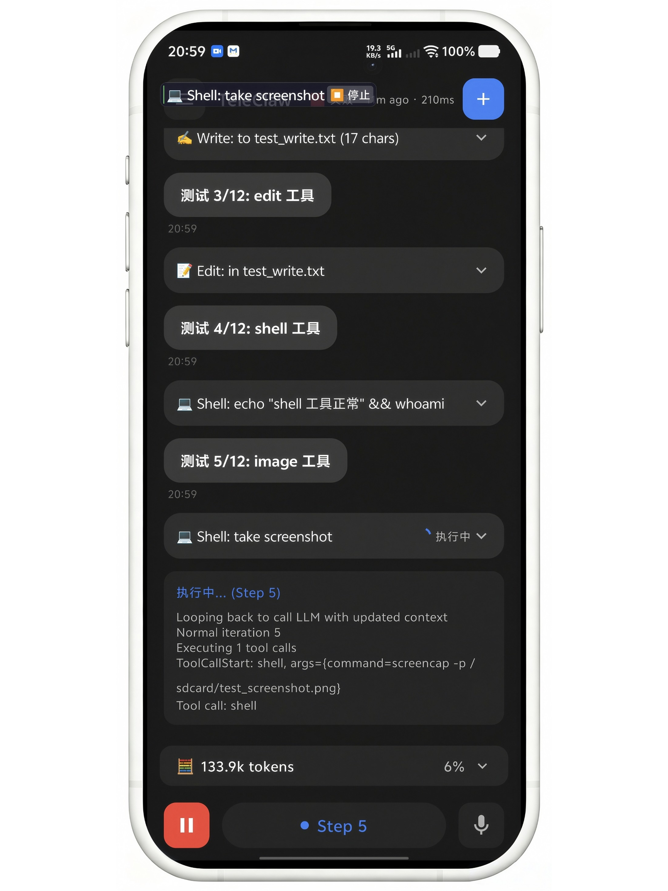
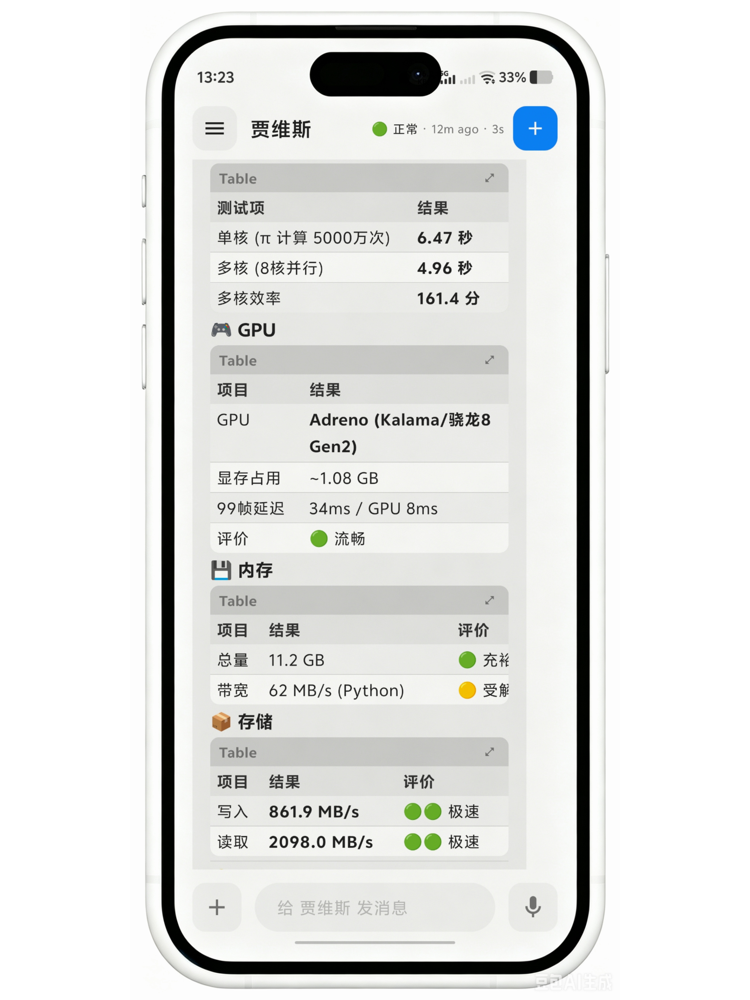

# 🤖 TeleClaw - AI Agent for Android

> Your intelligent mobile assistant with on-device AI capabilities

---

## ✨ Features

- 🧠 **AI Agent** — Intelligent conversation and task execution
- 📱 **Phone Control** — Automated device operation via accessibility services
- 🖥️ **Virtual Display** — Background app automation without root
- 🛠️ **Tool System** — File operations, shell commands, web fetch and more
- 💾 **Memory System** — Persistent conversation context across sessions
- ⏰ **Scheduled Tasks** — Cron-like automation for recurring jobs
- 🔒 **Privacy First** — On-device processing, your data stays on your phone

## 📲 Download

👉 **[Latest Release](../../releases/latest)**

| Version | Date | Size | Link |
|---------|------|------|------|
| v1.4.2 | 2026-06 | ~10 MB | [Download APK](../../releases/latest) |

> Minimum Android 8.0 (API 26)

## 📸 Screenshots

<div align="center">
  
  
  
</div>

## 🏗️ Architecture

TeleClaw uses a modular agent architecture designed for mobile:

```
┌─────────────────────────┐
│        UI Layer          │   Jetpack Compose
├─────────────────────────┤
│      Agent Core          │   Conversation loop & orchestration
├──────────┬──────────────┤
│  Memory   │    Tools     │   BM25 search · Shell · File · Web
├──────────┴──────────────┤
│    Platform Services     │   Shizuku · Accessibility · VirtualDisplay
├─────────────────────────┤
│      VLM Client          │   OpenAI-compatible API
└─────────────────────────┘
```

> 📖 See [architecture.md](docs/architecture.md) for detailed design

## 🔧 Build from Source

> ⚠️ **Note:** Some proprietary modules are not included in this repository.
> The source code provided is the open framework. For the full experience,
> download the pre-built APK from [Releases](../../releases/latest).

```bash
git clone https://github.com/teleclaw/TeleClaw.git
cd TeleClaw
./gradlew assembleDebug
```

## 🤝 Contributing

We appreciate your interest! At this time, we are not accepting code contributions as the core agent modules are proprietary. Bug reports and feature requests are welcome via [Issues](../../issues).

Please read [CONTRIBUTING.md](CONTRIBUTING.md) for guidelines.

## 📄 License

```
Copyright 2026 TeleClaw
...
```

---

## ❤️ Support Us

If you like TeleClaw, please consider supporting our development!

- 🐱 [GitHub Sponsors](https://github.com/sponsors/tmzmessi)
- ☕ Buy Me a Coffee (coming soon)
- 💚 WeChat (coming soon)
- 🔗 Alipay (coming soon)

---

<div align="center">
  Made with ❤️ by TeleClaw Team
</div>
